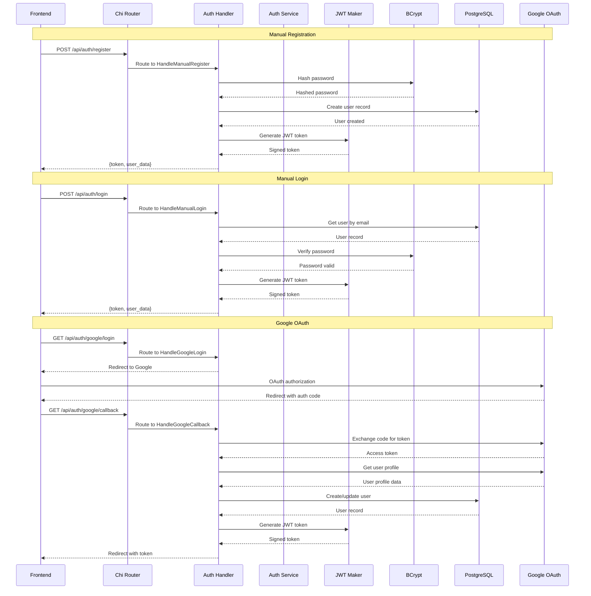
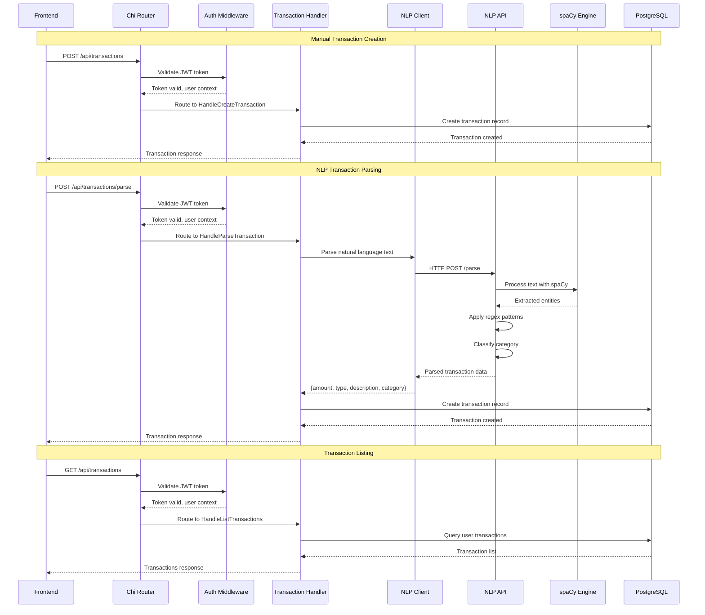
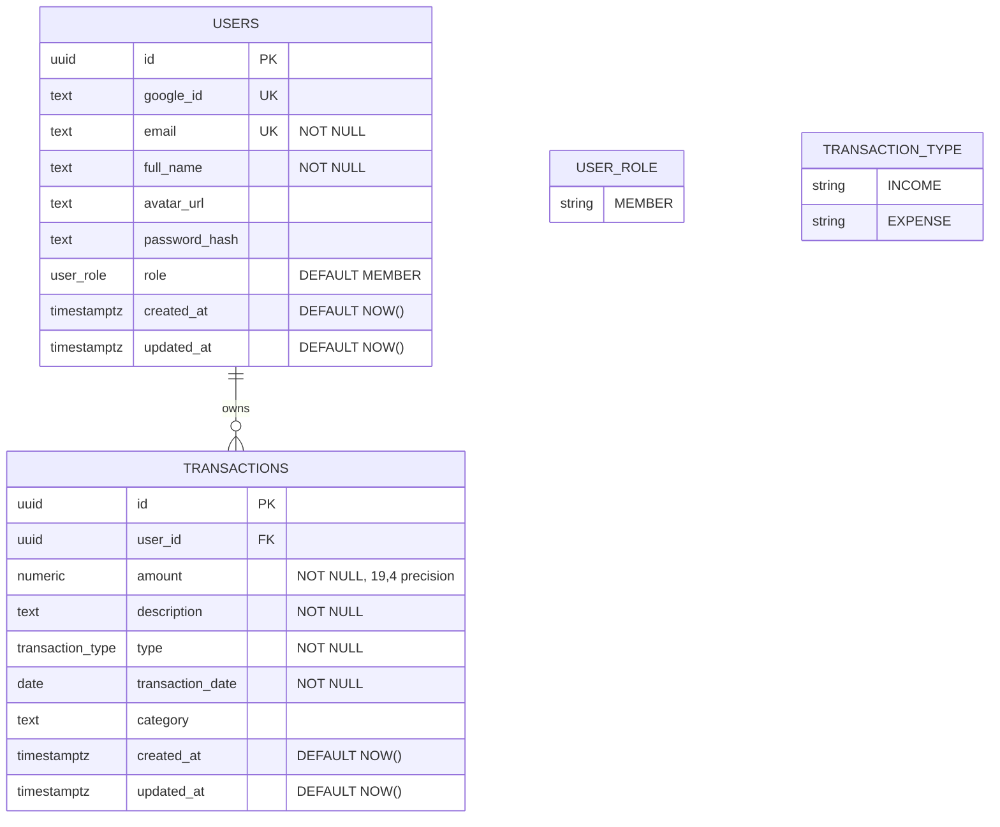
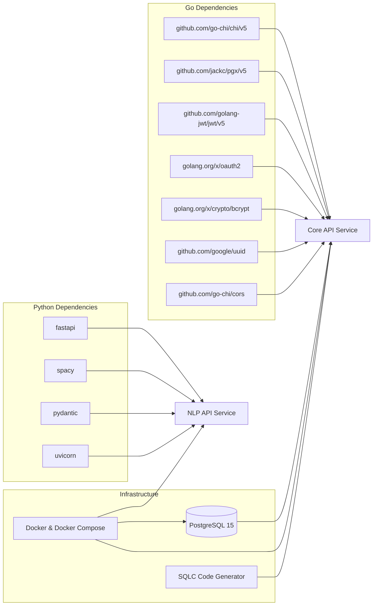
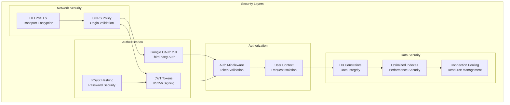

# RupeeFlow Backend Architecture

## System Architecture Diagram

```mermaid
graph TB
    %% External Services
    subgraph "External Services"
        GoogleOAuth[Google OAuth 2.0]
        Frontend[Frontend Client<br/>React/HTML/JS]
    end

    %% Core Infrastructure
    subgraph "Infrastructure Layer"
        Docker[Docker Compose<br/>Orchestration]
        Nginx[Load Balancer<br/>(Optional)]
    end

    %% Application Layer
    subgraph "Application Services"
        subgraph "Core API Service (Go)"
            Router[Chi Router<br/>HTTP Middleware]
            AuthHandler[Authentication<br/>Handlers]
            TxnHandler[Transaction<br/>Handlers]
            UserHandler[User Profile<br/>Handlers]
            
            subgraph "Business Logic"
                AuthService[Auth Service<br/>JWT + OAuth]
                TxnService[Transaction Service<br/>CRUD Operations]
                NLPClient[NLP Client<br/>HTTP Adapter]
            end
            
            subgraph "Security Layer"
                JWTMaker[JWT Token Maker<br/>HS256 Signing]
                BCrypt[Password Hasher<br/>bcrypt]
                AuthMiddleware[Auth Middleware<br/>Token Validation]
            end
        end
        
        subgraph "NLP API Service (Python)"
            FastAPI[FastAPI Framework<br/>Async HTTP Server]
            NLPParser[Natural Language<br/>Transaction Parser]
            SpaCy[spaCy NLP Engine<br/>English Model]
            
            subgraph "ML Components"
                EntityExtractor[Entity Extraction<br/>Amount, Category, Type]
                PatternMatcher[Regex Pattern<br/>Matching Engine]
                CategoryClassifier[Category Classification<br/>Rule-based System]
            end
        end
    end

    %% Data Layer
    subgraph "Data Persistence Layer"
        subgraph "PostgreSQL Database"
            UserTable[(Users Table<br/>UUID, OAuth, Manual Auth)]
            TxnTable[(Transactions Table<br/>Amount, Type, Category)]
            Indexes[(Database Indexes<br/>Performance Optimization)]
        end
        
        subgraph "Connection Management"
            PGXPool[PGX Connection Pool<br/>PostgreSQL Driver]
            SQLC[SQLC Generated Code<br/>Type-safe Queries]
        end
    end

    %% Data Flow Connections
    Frontend -->|HTTP/HTTPS| Router
    GoogleOAuth -->|OAuth 2.0 Flow| AuthHandler
    
    Router --> AuthHandler
    Router --> TxnHandler
    Router --> UserHandler
    
    AuthHandler --> AuthService
    TxnHandler --> TxnService
    UserHandler --> TxnService
    
    AuthService --> JWTMaker
    AuthService --> BCrypt
    AuthMiddleware --> JWTMaker
    
    TxnHandler --> NLPClient
    NLPClient -->|HTTP REST API| FastAPI
    
    FastAPI --> NLPParser
    NLPParser --> SpaCy
    NLPParser --> EntityExtractor
    NLPParser --> PatternMatcher
    NLPParser --> CategoryClassifier
    
    TxnService --> SQLC
    AuthService --> SQLC
    SQLC --> PGXPool
    PGXPool --> UserTable
    PGXPool --> TxnTable
    PGXPool --> Indexes
    
    Docker -.-> Router
    Docker -.-> FastAPI
    Docker -.-> PGXPool

    %% Styling
    classDef serviceBox fill:#e1f5fe,stroke:#0277bd,stroke-width:2px
    classDef dataBox fill:#f3e5f5,stroke:#7b1fa2,stroke-width:2px
    classDef externalBox fill:#e8f5e8,stroke:#2e7d32,stroke-width:2px
    classDef securityBox fill:#fff3e0,stroke:#ef6c00,stroke-width:2px
    
    class Router,FastAPI,AuthHandler,TxnHandler,UserHandler serviceBox
    class UserTable,TxnTable,PGXPool,SQLC dataBox
    class GoogleOAuth,Frontend externalBox
    class JWTMaker,BCrypt,AuthMiddleware securityBox
```

## Request Flow Diagrams

### Authentication Flow


### Transaction Processing Flow


## Data Model Relationships



## Component Dependencies



## Security Architecture


